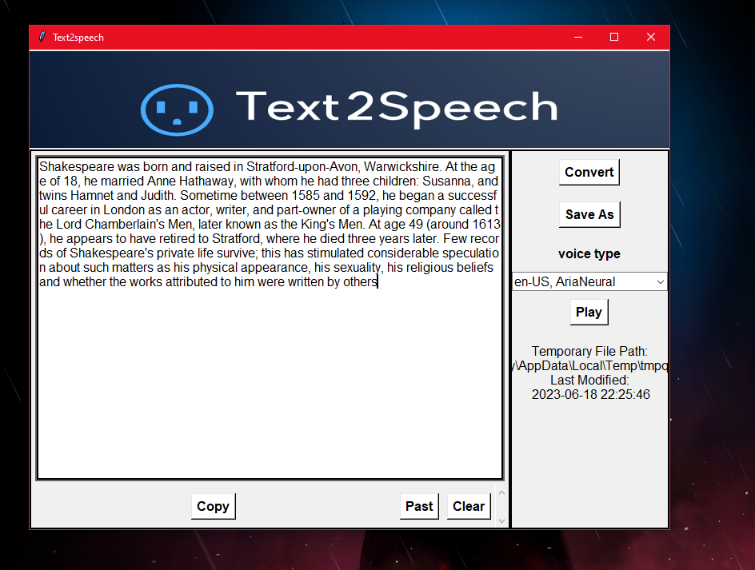

# 文字转语音（Text2Speech）

* [中文](https://chat.openai.com/README-zh.md)
* [English](https://chat.openai.com/README.md)

Text2Speech 是一个使用 Python、Tinkers 和 Edge-TTS 构建的 Windows 应用程序，可以将文本转换为语音。它允许用户从书面输入生成口语输出。



## 下载

可以从 [Releases](https://github.com/shalayiding/Text2Speech/releases/tag/Text2Speech_V1.0) 页面下载 Text2Speech 的最新版本。选择适合您的 Windows 操作系统的版本，然后按照安装说明进行安装。

## 功能

* 将文本转换为语音。
* 提供可自定义的语音设置。
* 使用 Tinkers 构建的用户友好界面。
* 利用 Edge-TTS 进行高质量的语音合成。
* 抖音热门讲故事声音.

## 从源代码安装

要从源代码手动安装 Text2Speech，请按照以下步骤进行操作：

1. 将该存储库克隆到本地机器：
    ``git clone https://github.com/shalayiding/Text2Speech.git``
2. 运行以下命令安装所需的依赖项：
    ```pip install -r requirements.txt```
3. 运行以下命令启动应用程序：
    ```python application.py```

## 鸣谢

该项目利用了以下开源库和资源：

* [Tinkers](https://github.com/python-tinkter/tinkter) - Python GUI 工具包。
* [Edge-TTS](https://pypi.org/project/edge-tts/) - 一个允许您使用 Microsoft Edge 的文本到语音功能的 Python 模块。
